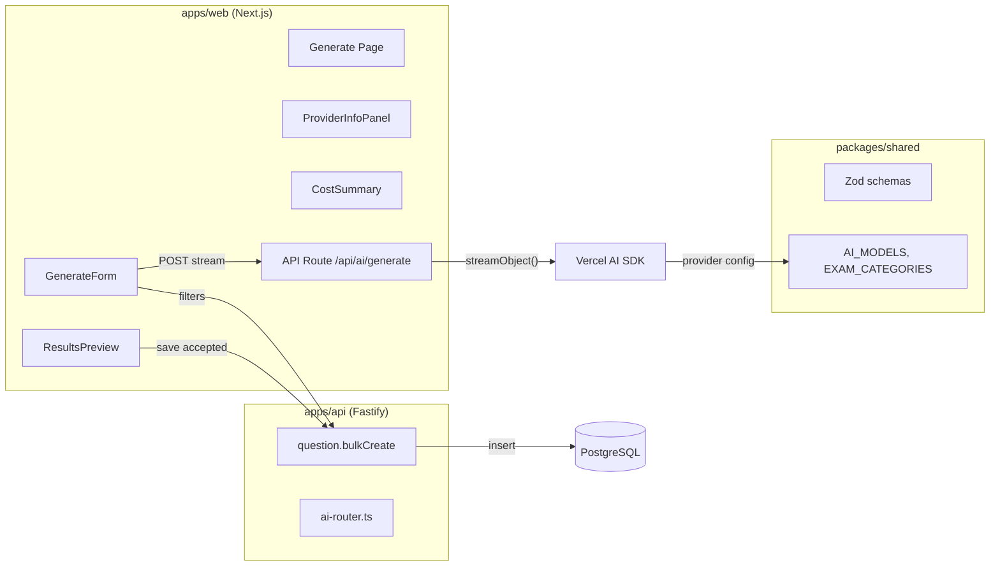
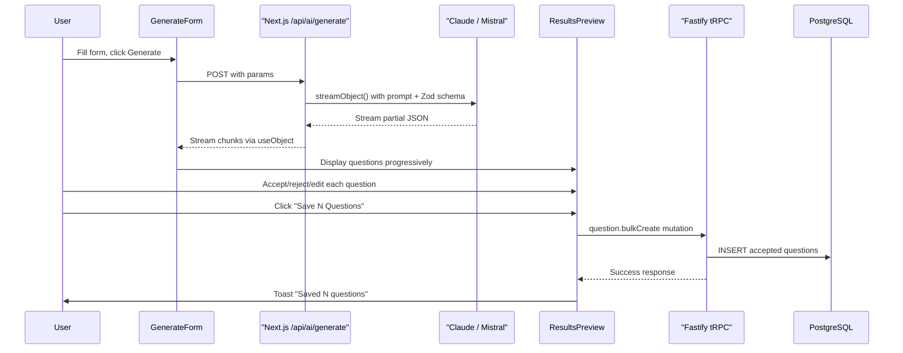

# AI Question Generator Form

## Architecture

The generator spans all three layers of the monorepo:




### Key Decision: Streaming via Next.js API Route

The prompt requires `useChat` for streaming, but for **structured object generation** (JSON questions), the Vercel AI SDK's `useObject` (from `ai/react`) + `streamObject` is the correct pattern. `useChat` is for chat interfaces; `useObject` progressively renders typed objects from a streaming endpoint.

A **Next.js API route** at `apps/web/src/app/api/ai/generate/route.ts` handles streaming because:

- Vercel AI SDK hooks (`useObject`) work seamlessly with Next.js route handlers
- tRPC v11 mutations are request-response (no streaming support)
- The route uses `AI_MODELS` from `@examforge/shared/constants` to select the correct provider, following the `ai-router.ts` pattern

**CRUD operations** (bulk save, filters) stay in the **Fastify tRPC** layer where all database logic lives.

---

## Files to Create

### 1. Shared Package — Generation Schemas

**[packages/shared/src/validators/ai-generate.ts](packages/shared/src/validators/ai-generate.ts)**

New Zod schemas for the generation form input and AI output:

```typescript
export const generateQuestionsInputSchema = z.object({
  provider: z.enum(["anthropic", "mistral"]),
  examId: z.string().uuid(),
  subject: z.string().min(1),
  topic: z.string().min(1),
  count: z.number().int().min(1).max(50),
  difficulty: z.enum(["easy", "medium", "hard"]),
  questionType: z.enum(["mcq", "true_false", "fill_blank", "match", "assertion"]),
  customPrompt: z.string().optional(),
});

export const generatedQuestionSchema = z.object({
  content: questionContentSchema,
  subject: z.string(),
  topic: z.string(),
  difficulty: z.enum(["easy", "medium", "hard"]),
});
```

Add cost estimation constants to [packages/shared/src/constants/index.ts](packages/shared/src/constants/index.ts):

```typescript
export const AI_COST_PER_1K_TOKENS = {
  "claude-sonnet-4-20250514": { input: 0.003, output: 0.015 },
  "mistral-large-latest": { input: 0.002, output: 0.006 },
} as const;
```

### 2. Backend — Bulk Create Mutation

**[apps/api/src/trpc/routers/question.ts](apps/api/src/trpc/routers/question.ts)** — Add `bulkCreate` to existing router:

```typescript
bulkCreate: protectedProcedure
  .input(z.object({
    questions: z.array(createQuestionSchema).min(1).max(50),
  }))
  .mutation(async ({ ctx, input }) => {
    const inserted = await ctx.db.insert(questions).values(
      input.questions.map(q => ({
        examId: q.examId,
        type: q.content.type,
        content: q.content,
        subject: q.subject,
        topic: q.topic,
        difficulty: q.difficulty,
        source: "ai-generated",
        orgId: ctx.orgId,
      }))
    ).returning({ id: questions.id });
    return { success: true, count: inserted.length };
  }),
```

### 3. Frontend — Install Dependencies

**[apps/web/package.json](apps/web/package.json)** — Add:

- `ai` (Vercel AI SDK core + React hooks)
- `@ai-sdk/anthropic` (Claude provider)
- `@ai-sdk/mistral` (Mistral provider)

### 4. Frontend — Next.js Streaming API Route

**[apps/web/src/app/api/ai/generate/route.ts](apps/web/src/app/api/ai/generate/route.ts)**

```typescript
import { streamObject } from "ai";
import { anthropic } from "@ai-sdk/anthropic";
import { mistral } from "@ai-sdk/mistral";
import { generateQuestionsInputSchema, generatedQuestionSchema } from "@examforge/shared/validators";

export async function POST(req: Request) {
  const body = generateQuestionsInputSchema.parse(await req.json());
  const model = body.provider === "anthropic"
    ? anthropic("claude-sonnet-4-20250514")
    : mistral("mistral-large-latest");

  const result = streamObject({
    model,
    schema: z.object({ questions: z.array(generatedQuestionSchema) }),
    prompt: buildPrompt(body),
  });

  return result.toTextStreamResponse();
}
```

### 5. Frontend — Add Missing shadcn/ui Components

Run `npx shadcn@latest add textarea tabs checkbox slider` to add components needed by the form. Currently missing from [apps/web/src/components/ui/](apps/web/src/components/ui/).

### 6. Frontend — Generate Page and Components

**[apps/web/src/app/(dashboard)/generate/page.tsx](apps/web/src/app/(dashboard)/generate/page.tsx)** — Server Component shell:

```typescript
export const metadata = { title: "Generate Questions — ExamForge" };
export default function GeneratePage() {
  return <QuestionGenerator />;
}
```

**[apps/web/src/components/generate/question-generator.tsx](apps/web/src/components/generate/question-generator.tsx)** — Main client component orchestrating the flow:

```
"use client"
- State: formData, generatedQuestions[], selectedQuestions Set, editingQuestion
- Phase: "form" → "generating" → "results"
- Uses useObject() from ai/react for streaming generation
- Uses trpc.question.bulkCreate.useMutation() for saving
```

**[apps/web/src/components/generate/generate-form.tsx](apps/web/src/components/generate/generate-form.tsx)** — Form with:

- AI provider selector (radio: Claude for quality, Mistral for bulk)
- Exam dropdown (from `trpc.question.filters` data)
- Subject dropdown (from same filters query)
- Topic text input
- Count input (1-50, default 10)
- Difficulty selector (easy/medium/hard)
- Question type selector (MCQ, True/False, Fill-blank, Match, Assertion-Reason)
- Custom prompt textarea (optional override)

**[apps/web/src/components/generate/provider-info-panel.tsx](apps/web/src/components/generate/provider-info-panel.tsx)** — Side panel showing:

- Selected model name and provider
- Features/strengths of the selected provider
- Estimated cost based on count and model pricing from `AI_COST_PER_1K_TOKENS`

**[apps/web/src/components/generate/generation-progress.tsx](apps/web/src/components/generate/generation-progress.tsx)** — Streaming progress:

- Progress bar showing `questionsReceived / totalRequested`
- Animated skeleton cards for pending questions
- Real-time count as `useObject` streams partial results

**[apps/web/src/components/generate/results-preview.tsx](apps/web/src/components/generate/results-preview.tsx)** — Results view:

- List of generated question cards
- Per-question actions: Accept (checkbox), Reject (remove), Edit (inline dialog)
- Select all / Deselect all toggle
- "Save N Questions" button that calls `trpc.question.bulkCreate`
- Toast notification on save success

**[apps/web/src/components/generate/question-edit-dialog.tsx](apps/web/src/components/generate/question-edit-dialog.tsx)** — Edit dialog:

- Dialog with form fields matching the question type
- Pre-filled with generated content
- Save updates the question in the local state (before DB save)

**[apps/web/src/components/generate/cost-summary.tsx](apps/web/src/components/generate/cost-summary.tsx)** — Post-generation summary:

- Tokens used (input + output)
- Estimated cost in USD
- Model used, time taken

### 7. Dashboard Nav Update

**[apps/web/src/app/(dashboard)/layout.tsx](apps/web/src/app/(dashboard)/layout.tsx)** — Add "Generate" nav link between "Question Bank" and "Start Exam":

```tsx
<Link href={"/generate" as "/"} className="text-foreground/80 transition-colors hover:text-foreground">
  Generate
</Link>
```

---

## Data Flow




---

## Key Implementation Notes

- The `useObject` hook from `ai/react` provides `object` (partial typed result), `isLoading`, and `error` -- ideal for progressively rendering question cards as the LLM generates them
- The streaming API route validates input with Zod and selects the provider based on `AI_MODELS` from shared constants, maintaining the `ai-router.ts` pattern
- The `bulkCreate` tRPC mutation uses `protectedProcedure` (auth required) and sets `source: "ai-generated"` on all saved questions
- Cost estimation uses token counts from the AI SDK response (`usage.promptTokens`, `usage.completionTokens`) combined with `AI_COST_PER_1K_TOKENS` constants
- The prompt builder function constructs a detailed system + user prompt that includes exam name, subject, topic, difficulty, question type schema, and count

