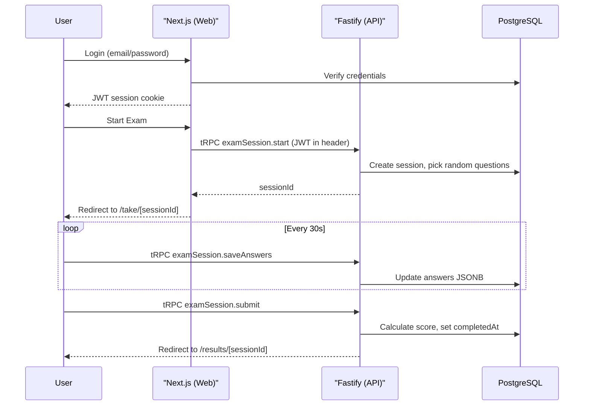

# Auth + Exam-Taking Interface

## Current State

- **Web:** Next.js 15 with `/` (home) and `/questions` (question bank) pages
- **API:** Fastify 5 with tRPC `health` and `question` routers only
- **DB:** `exam_sessions` table exists with `userId`, `answers` (JSONB), `score`, `timeTakenSeconds`, `completedAt`
- **Auth:** None. No NextAuth, no middleware, no protected routes
- **Stores:** Zustand installed but unused
- **Missing packages:** `framer-motion`, `next-auth`, AI SDK provider packages

## Architecture



---

## Phase 1: Basic Auth (NextAuth v5 + JWT)

Since the API runs on a **separate Fastify server**, we use JWT strategy so the client can send the token to both Next.js and Fastify.

### New Dependencies (apps/web)

- `next-auth@beta` (v5)
- `@auth/drizzle-adapter` (optional, for session persistence)
- `bcryptjs` + `@types/bcryptjs`

### Files to Create

- **[apps/web/src/lib/auth.ts](apps/web/src/lib/auth.ts)** -- NextAuth v5 config
  - JWT strategy (not database sessions)
  - Credentials provider: match email against `users` table, verify bcrypt password
  - Callbacks: include `userId` and `role` in JWT and session
  - For dev: seed a test user in `local-setup.sql`
- **[apps/web/src/app/api/auth/[...nextauth]/route.ts](apps/web/src/app/api/auth/[...nextauth]/route.ts)** -- NextAuth route handler (`export { GET, POST } from auth`)
- **[apps/web/src/middleware.ts](apps/web/src/middleware.ts)** -- Protect routes
  - Public: `/`, `/auth/login`, `/api/auth/`\*
  - Protected: everything else (`/questions`, `/take/`_, `/results/`_, etc.)
- **[apps/web/src/app/auth/login/page.tsx](apps/web/src/app/auth/login/page.tsx)** -- Login page with email + password form, shadcn UI

### Files to Modify

- **[apps/web/src/components/providers.tsx](apps/web/src/components/providers.tsx)** -- Wrap with `SessionProvider`, pass JWT in tRPC `httpBatchLink` headers via `Authorization: Bearer <token>`
- **[apps/api/src/trpc/context.ts](apps/api/src/trpc/context.ts)** -- Decode JWT from `Authorization` header using `NEXTAUTH_SECRET` (via `jose` library), set `userId` and `role` on context
- **[apps/api/src/trpc/trpc.ts](apps/api/src/trpc/trpc.ts)** -- Add `protectedProcedure` middleware that asserts `ctx.userId` exists
- **[apps/web/src/app/(dashboard)/layout.tsx](<apps/web/src/app/(dashboard)/layout.tsx>)** -- Add user avatar/name and logout button in header, add "Start Exam" nav link
- **[scripts/local-setup.sql](scripts/local-setup.sql)** -- Add a seeded dev user with hashed password

### New Dependency (apps/api)

- `jose` (JWT verification)

---

## Phase 2: Exam Session tRPC Router

### New File

- **[apps/api/src/trpc/routers/exam-session.ts](apps/api/src/trpc/routers/exam-session.ts)** -- All procedures use `protectedProcedure`

| Procedure     | Type     | Input                                          | Description                                                                                            |
| ------------- | -------- | ---------------------------------------------- | ------------------------------------------------------------------------------------------------------ |
| `start`       | Mutation | `{ examId, totalQuestions, durationMinutes? }` | Pick N random questions from DB, create `exam_sessions` row, return `{ sessionId }`                    |
| `getSession`  | Query    | `{ sessionId }`                                | Return session + hydrated question data (content, subject, type) -- **exclude correct answers**        |
| `saveAnswers` | Mutation | `{ sessionId, answers, flagged? }`             | Update answers JSONB, update `updatedAt`                                                               |
| `submit`      | Mutation | `{ sessionId, answers }`                       | Calculate score by comparing with correct answers, set `completedAt`, `score`, `timeTakenSeconds`      |
| `getResults`  | Query    | `{ sessionId }`                                | Return full results: score, time, per-question breakdown with user answer, correct answer, explanation |

**Key design decisions:**

- `getSession` must NOT return correct answers (cheating prevention) -- only question text and options
- `getResults` only works after `completedAt` is set
- `start` uses `sql ORDER BY random() LIMIT N` to pick questions
- Timer duration stored in session metadata JSONB (avoids schema migration)

### File to Modify

- **[apps/api/src/trpc/index.ts](apps/api/src/trpc/index.ts)** -- Register `examSession` router

### Validators to Add

- **[packages/shared/src/validators/exam.ts](packages/shared/src/validators/exam.ts)** -- Add `examSessionSaveSchema` (`{ sessionId, answers, flagged? }`) alongside existing `examSessionStartSchema` and `examSessionSubmitSchema`

---

## Phase 3: Exam-Taking Frontend

### New Dependencies (apps/web)

- `framer-motion` (question transitions)

### New shadcn Components to Add

- `dialog` (submit confirmation modal)
- `radio-group` (MCQ options)
- `progress` (timer progress bar)
- `alert-dialog` (leave exam warning)
- `sonner` (toast notifications)

### Zustand Store

- **[apps/web/src/stores/exam-store.ts](apps/web/src/stores/exam-store.ts)**

```typescript
interface ExamState {
  sessionId: string | null;
  questions: ExamQuestion[];
  currentIndex: number;
  answers: Record<string, number>;
  flagged: Set<string>;
  startedAt: Date | null;
  durationMinutes: number;
  timeRemaining: number; // seconds

  // Actions
  setSession: (data: SessionData) => void;
  selectAnswer: (questionId: string, optionIndex: number) => void;
  toggleFlag: (questionId: string) => void;
  goToQuestion: (index: number) => void;
  goNext: () => void;
  goPrev: () => void;
  tick: () => void; // decrement timer
  reset: () => void;
}
```

### Layout and Pages

- **[apps/web/src/app/(exam)/layout.tsx](<apps/web/src/app/(exam)/layout.tsx>)** -- Full-screen layout, no header/nav, just a minimal top bar with exam name + timer + exit button. Registers `beforeunload` warning.
- **[apps/web/src/app/(exam)/take/[sessionId]/page.tsx](<apps/web/src/app/(exam)/take/[sessionId]/page.tsx>)** -- Main exam page (client component). Fetches session via `trpc.examSession.getSession`, initializes Zustand store, renders exam UI. Registers keyboard shortcuts and auto-save interval.
- **[apps/web/src/app/(dashboard)/exams/start/page.tsx](<apps/web/src/app/(dashboard)/exams/start/page.tsx>)** -- Exam start page: select exam, choose number of questions, optional time limit. Calls `trpc.examSession.start`, then `router.push(/take/[sessionId])`.
- **[apps/web/src/app/(dashboard)/results/[sessionId]/page.tsx](<apps/web/src/app/(dashboard)/results/[sessionId]/page.tsx>)** -- Results page: score card, time taken, per-question breakdown with correct answer highlight and explanation. Reuses question display patterns from `question-card.tsx`.

### Exam Components

- **[apps/web/src/components/exam/exam-timer.tsx](apps/web/src/components/exam/exam-timer.tsx)** -- Countdown timer display. Reads `timeRemaining` from Zustand. Shows MM:SS format. Progress bar turns red at < 5 min. Calls `tick()` every second via `setInterval`. When hits 0, auto-submits.
- **[apps/web/src/components/exam/question-nav.tsx](apps/web/src/components/exam/question-nav.tsx)** -- Sidebar with numbered circles in a grid. Color-coded: gray (unanswered), green (answered), orange (flagged), blue ring (current). Clicking navigates to that question. On mobile, rendered as a horizontal scrollable strip below the question.
- **[apps/web/src/components/exam/question-display.tsx](apps/web/src/components/exam/question-display.tsx)** -- Renders the current question with type-specific UI. MCQ: radio buttons with keyboard hints (A/B/C/D). True/False: two buttons. Other types similarly. Wrapped in `AnimatePresence` + `motion.div` for slide transitions. Shows flag toggle button and question number.
- **[apps/web/src/components/exam/submit-modal.tsx](apps/web/src/components/exam/submit-modal.tsx)** -- Dialog showing exam summary before submission: X answered, Y unanswered, Z flagged. Confirm/Cancel buttons. On confirm, calls `trpc.examSession.submit` then redirects to results.
- **[apps/web/src/components/exam/exam-results.tsx](apps/web/src/components/exam/exam-results.tsx)** -- Score card (percentage, correct/incorrect/unanswered counts), time taken, per-question expandable breakdown reusing patterns from existing `question-card.tsx` (correct answer highlighted, user answer shown, explanation).

### Integration Features

- **Auto-save:** In the exam page, `setInterval` every 30s calls `trpc.examSession.saveAnswers` with current Zustand state. Uses `useMutation` with `onError` toast.
- **Keyboard shortcuts:** `useEffect` with `keydown` listener. A/B/C/D select options, Left/Right arrows navigate, F toggles flag, Enter opens submit modal on last question.
- **Browser close warning:** `beforeunload` event in the `(exam)` layout to warn when leaving during active exam.
- **State restoration:** On page load, `getSession` returns saved answers. Zustand store initialized from server state so refresh works seamlessly.

---

## File Change Summary

| Category   | New Files                                          | Modified Files                                                  |
| ---------- | -------------------------------------------------- | --------------------------------------------------------------- |
| Auth       | 3 (auth config, API route, login page, middleware) | 4 (providers, context, trpc, dashboard layout, local-setup.sql) |
| API Router | 1 (exam-session router)                            | 2 (trpc index, validators)                                      |
| Frontend   | 10 (store, layout, 3 pages, 5 components)          | 1 (dashboard layout nav)                                        |
| **Total**  | **14 new**                                         | **~7 modified**                                                 |
