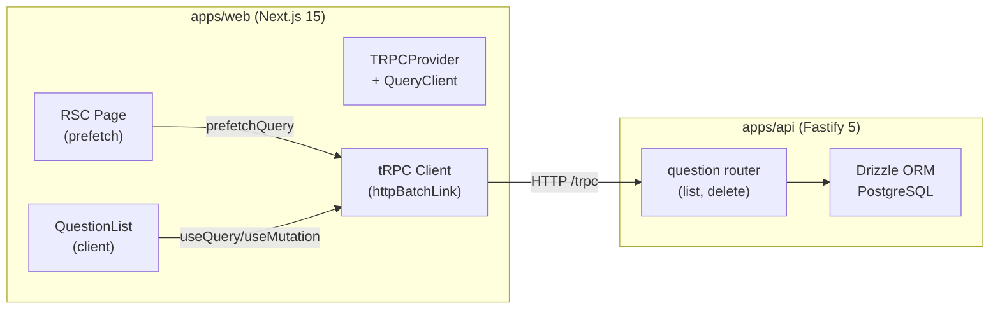

# Question Bank UI

## Current State

The codebase is a minimal shell. The DB schema and validators for questions exist in `packages/shared`, but there is:

- No tRPC question router (only `health` exists)
- No tRPC client configured on the web side
- No TanStack Query provider
- No shadcn/ui components installed (config exists at `apps/web/components.json`)
- No dashboard layout or route group
- No `@trpc/server/adapters/fetch` installed (needed for Next.js RSC prefetching)

## Architecture




## Implementation Plan

### 1. Backend: Question tRPC Router

Create `[apps/api/src/trpc/routers/question.ts](apps/api/src/trpc/routers/question.ts)` with two procedures:

- `**question.list**` (query) -- Paginated list with filters
  - Input (Zod): `{ page?, limit?, search?, subject?, difficulty?, examId?, source?, type? }`
  - Drizzle query on `questions` table joined with `exams` (for exam name)
  - `ilike` for search on `content->>'question'` + `subject`
  - `eq` filters for difficulty, examId, type, source
  - Returns `{ items, total, page, totalPages }`
- `**question.delete**` (mutation)
  - Input: `{ id: z.string().uuid() }`
  - Deletes from `questions` table (cascades to `question_versions`)

Register in `[apps/api/src/trpc/index.ts](apps/api/src/trpc/index.ts)`:

```typescript
import { questionRouter } from "./routers/question.js";

export const appRouter = router({
  health: healthRouter,
  question: questionRouter,
});
```

### 2. Frontend Infrastructure: tRPC + TanStack Query

**a) tRPC client** -- Create `[apps/web/src/lib/trpc.ts](apps/web/src/lib/trpc.ts)`:

- `createTRPCReact<AppRouter>()` for client hooks
- `trpcClient` with `httpBatchLink` pointing to `http://localhost:4000/trpc`
- Helper for server-side caller (for RSC prefetching via `createTRPCClient`)

**b) Query provider** -- Create `[apps/web/src/components/providers.tsx](apps/web/src/components/providers.tsx)`:

- `"use client"` component wrapping `QueryClientProvider` + `trpc.Provider`
- Stable `queryClient` and `trpcClient` via `useState`

**c) Update root layout** at `[apps/web/src/app/layout.tsx](apps/web/src/app/layout.tsx)`:

- Wrap `{children}` with `<Providers>`

### 3. Install shadcn/ui Components

Run `npx shadcn@latest add` for these components (inside `apps/web/`):

- `button`, `card`, `badge`, `input`, `select`, `skeleton`, `separator`, `collapsible`

### 4. Dashboard Layout

Create `[apps/web/src/app/(dashboard)/layout.tsx](apps/web/src/app/(dashboard)`/layout.tsx):

- Simple layout shell with a sidebar/header skeleton and `{children}` in main area
- Minimal for now -- just enough to frame the questions page

### 5. Questions Page (Server Component)

Create `[apps/web/src/app/(dashboard)/questions/page.tsx](apps/web/src/app/(dashboard)`/questions/page.tsx):

- RSC that renders `<QuestionList />` (client component)
- Metadata export for page title
- Optionally prefetch the first page of questions using `createServerSideHelpers` from tRPC (or a vanilla `queryClient.prefetchQuery`)

### 6. QuestionList Client Component

Create `[apps/web/src/components/questions/question-list.tsx](apps/web/src/components/questions/question-list.tsx)` as a `"use client"` component:

**Filters bar** (top):

- Search `Input` with 300ms debounce (custom `useDebounce` hook)
- `Select` dropdowns for: Subject, Difficulty (easy/medium/hard), Exam, Question Type (mcq/true_false/...), Source
- Filter state managed via `useState`, passed as query params to tRPC

**Question cards** (main area):

- `Card` per question, collapsed by default showing: first line of question, subject badge, difficulty badge, type badge, source badge
- Expandable via `Collapsible` -- on expand shows: full question text, options (with correct answer highlighted in green), explanation
- For MCQ: render A/B/C/D options, highlight the correct one
- For other types: render type-appropriate content
- Edit button (links to future edit page or opens modal -- placeholder for now)
- Delete button with confirmation

**Pagination** (bottom):

- Page numbers / prev-next buttons
- 20 items per page
- Show total count

**Loading state**:

- `Skeleton` cards while data loads

**Empty state**:

- Friendly message when no questions match filters

### 7. useDebounce Hook

Create `[apps/web/src/hooks/use-debounce.ts](apps/web/src/hooks/use-debounce.ts)`:

- Generic debounce hook for search input (300ms delay)

## Key Files to Create/Modify


| Action  | File                                                                            |
| ------- | ------------------------------------------------------------------------------- |
| Create  | `apps/api/src/trpc/routers/question.ts`                                         |
| Modify  | `apps/api/src/trpc/index.ts`                                                    |
| Create  | `apps/web/src/lib/trpc.ts`                                                      |
| Create  | `apps/web/src/components/providers.tsx`                                         |
| Modify  | `apps/web/src/app/layout.tsx`                                                   |
| Create  | `apps/web/src/app/(dashboard)/layout.tsx`                                       |
| Create  | `apps/web/src/app/(dashboard)/questions/page.tsx`                               |
| Create  | `apps/web/src/components/questions/question-list.tsx`                           |
| Create  | `apps/web/src/components/questions/question-card.tsx`                           |
| Create  | `apps/web/src/hooks/use-debounce.ts`                                            |
| Install | shadcn/ui: button, card, badge, input, select, skeleton, separator, collapsible |


## Important Notes

- The `content` column is JSONB with a discriminated union on `type`. The UI must handle all 5 types (MCQ, True/False, Fill Blank, Match, Assertion) with appropriate rendering.
- Zod schemas from `@examforge/shared/validators` will be reused for the tRPC input validation on the `list` endpoint.
- No auth middleware exists yet, so the question router will use `publicProcedure` for now (matching the current `health` router pattern).
- The API runs on port 4000; the tRPC link will need `http://localhost:4000/trpc` (with an env var fallback for production).

